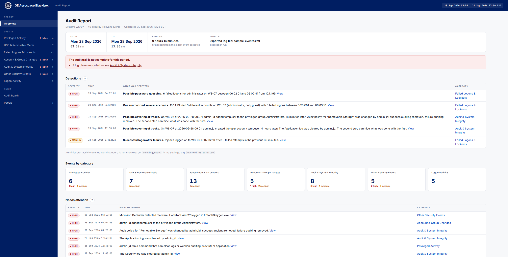
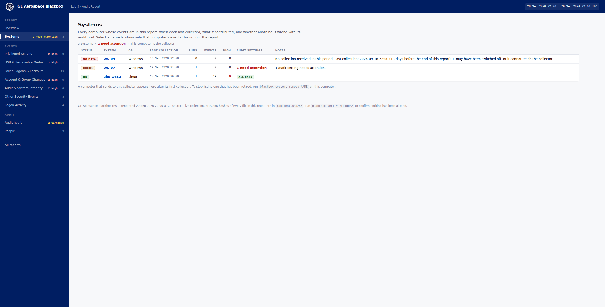

# Blackbox

**Plain-English audit log reports for air-gapped Windows and Linux systems.**

Blackbox reads your Windows event logs and Linux audit logs every hour. On
a daily, weekly or monthly schedule it turns them into a single HTML report
an auditor can actually read. No server, no database, no dependencies,
and nothing listening on the network. One PC, a PC with Linux VMs, or a
whole air-gapped LAN can be covered by one report.

**[⬇ Download the latest release](https://github.com/casea1/blackbox/releases/latest)** · [Windows guide](docs/windows.md) · [Linux guide](docs/linux.md) · [Security review notes](docs/security.md)



## Why Blackbox

- **Readable.** Events come out as sentences, not raw event IDs:
  - `4625 0xC000006A LogonType 3` becomes "Failed logon for administrator
    over the network from 10.1.1.99 — wrong password."
- **Focused.** Events are grouped the way auditors review them:
  privileged activity, USB, failed logons, account changes, and audit
  integrity. Each category is tagged with the NIST SP 800-53 controls it
  supports.
- **Nothing lost.** Logs are read every hour, so busy systems can't
  overwrite events before they're collected. The report says when events
  were lost, a log was cleared, or auditing was switched off.
- **Flags what matters.** Blackbox detects password guessing, new USB
  devices, users added to admin groups, audit tampering and more, and
  lists them first.
- **Easy to approve.** It's one small program with no third-party code. It
  only reads logs and never writes to them. It opens no ports and never
  listens on the network; on a LAN it only copies files to a shared folder.
  Every report is SHA-256 hashed so tampering can be detected.

## Supported systems

| | |
|---|---|
| Windows | Windows 11, Windows Server 2025 |
| Linux | Ubuntu 22.04 and 24.04, AlmaLinux 8.10 (auditd recommended, as the STIG requires) |

## Install

Nothing else needs to be installed first: no Go, no .NET, no runtime of any
kind.

**Windows:** download `blackbox-<version>-windows-amd64.zip` from
[Releases](https://github.com/casea1/blackbox/releases/latest), extract it,
and double-click **`Install.cmd`**.

**Linux:**

```sh
tar xzf blackbox-<version>-linux-amd64.tar.gz
cd blackbox-<version>-linux-amd64
sudo ./install.sh
```

Setup asks a few questions, each with a default you can accept by pressing
Enter. First it asks how this computer's events will be reviewed: on this
computer, or by a collector (see [Several computers](#several-computers)).
For a single computer it then asks:

- a site name
- how often to produce reports
- where to save them (any folder, including one you have locked down)
- how often to collect events

It then schedules collection, checks your audit settings against the DISA
STIG (it never changes them), and produces the first report. Run
`blackbox status` as an administrator at any time to check it is working.

**To change settings later**, such as moving reports to another folder,
run the installer again. It shows your current settings as the defaults.
On Windows, Blackbox appears in **Settings → Apps**, where it can be
uninstalled like any other program.

## Several computers

A Linux VM on a Windows PC, or a whole air-gapped LAN, can be reviewed in
one report. One computer, the **collector**, produces the reports. The
others send their events to its inbox folder every hour:

- a VM uses a VirtualBox shared folder
- LAN computers use an ordinary Windows share

Nothing listens on the network, and a computer that is off catches up when
it is back on. The report's **Systems** page shows every computer and
flags any that stopped sending.

Set up the collector first: run the installer and choose **This is the
collector**. Then run it on each other computer and choose **Send to a
collector**. The [LAN guide](docs/lan.md) walks through each setup.



## Reports

Reports are written to `C:\ProgramData\Blackbox\reports\` on Windows and
`/var/lib/blackbox/reports/` on Linux, or to the folder you chose during
setup. Open `index.html` there for the list of all reports. Each report is one self-contained `report.html` file with
these views:

| View | Shows |
|---|---|
| **Overview** | Reporting period, whether the audit trail is complete, and what needs attention |
| **Privileged Activity** | Admin logons, sudo/su, elevated programs, commands that tamper with auditing |
| **USB & Removable Media** | Devices with make, model and serial number, who used them, files copied |
| **Failed Logons & Lockouts** | Every failure with the reason decoded, plus password-guessing patterns |
| **Account & Group Changes** | Accounts created, deleted or reset; additions to admin groups |
| **Audit & System Integrity** | Logs cleared, auditing stopped, audit rules changed, time changes |
| **Other Security Events** | New services and tasks, kernel modules, anti-malware, SELinux/AppArmor |
| **Logon Activity** | Who logged on, how, and from where |
| **Systems** | On a collector: every computer, its last collection, and whether any stopped sending |
| **Audit health** | Collection completeness, STIG audit-setting check, busiest event types |
| **People** | Everything above, counted per account |

Each report also comes with `events.csv` for Excel, `events.jsonl` for
Splunk, and a `manifest.sha256`. [More about reports →](docs/reports.md)

## Try it without installing

Blackbox can build a report from log files copied off any system, on any
OS:

```sh
blackbox report --xml security.xml                                  # Windows (wevtutil export)
blackbox report --audit audit.log --syslog syslog                   # Linux
blackbox report --xml testdata/sample-events.xml                    # built-in Windows sample
blackbox report --audit testdata/linux/ubuntu-audit.log \
                --syslog testdata/linux/ubuntu-syslog               # built-in Ubuntu sample
```

## Documentation

- [Several computers (VMs and LANs)](docs/lan.md): collector, senders, day-to-day use
- [Windows guide](docs/windows.md): install, audit settings, what is read
- [Linux guide](docs/linux.md): install, auditd setup, what is read
- [Reports](docs/reports.md): report periods, severities, findings, output files
- [Configuration](docs/configuration.md): `blackbox.conf` settings
- [Security review notes](docs/security.md): what Blackbox does and doesn't do
- [Development](docs/development.md): building, testing, releasing
- [Design](docs/design.md): architecture and roadmap

## Building from source

Blackbox needs Go 1.24 or later and has no other dependencies:

```sh
go test ./...
VERSION=0.2.0 scripts/build.sh    # packages in dist/
```

## License

Copyright 2026 Austin Case. Licensed under the [Apache License, Version 2.0](LICENSE).
