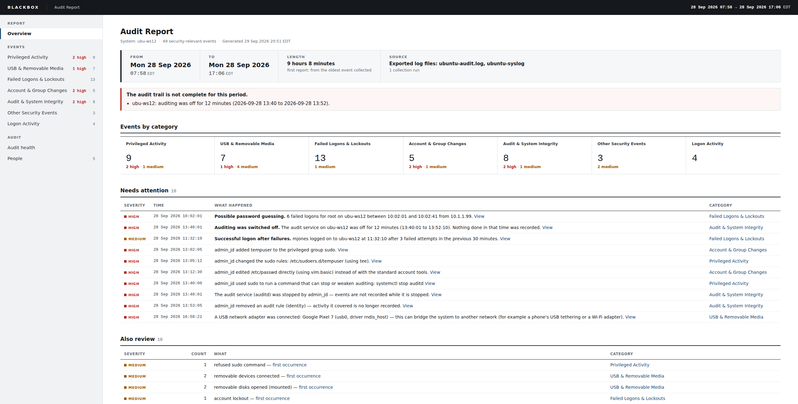
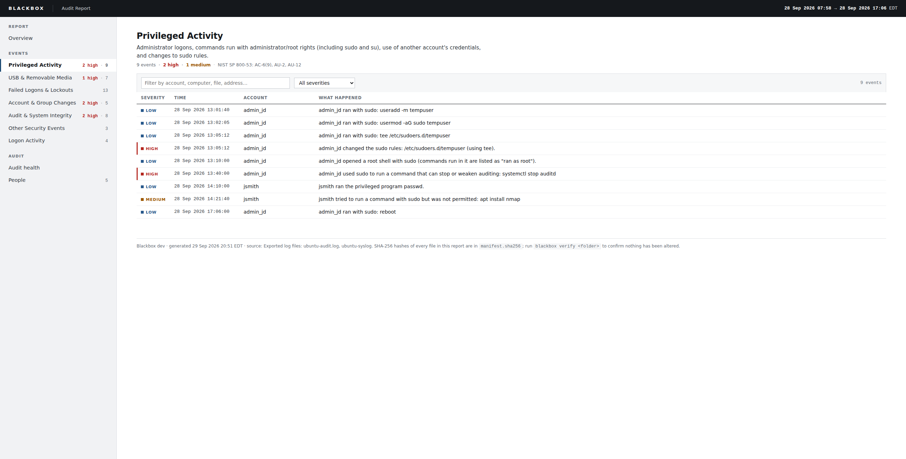
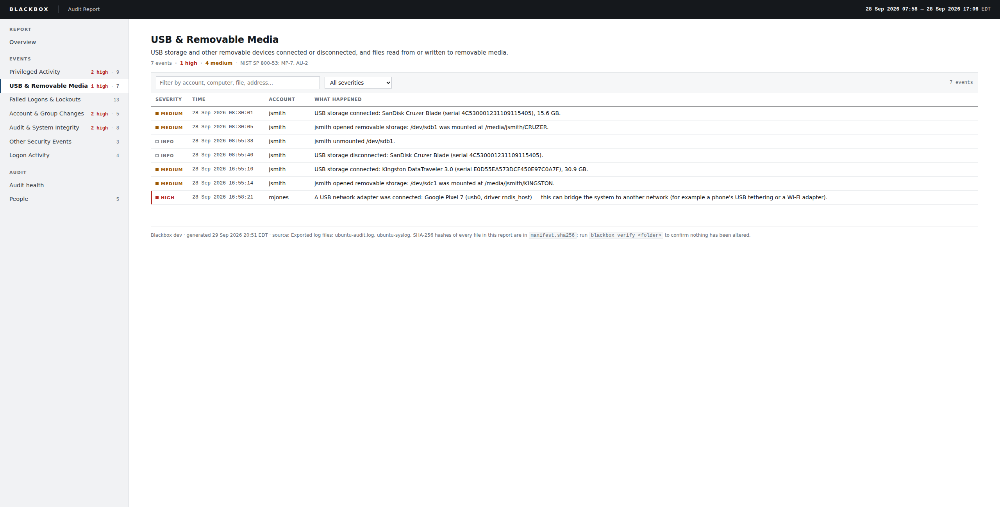

# Blackbox

Audit log review for air-gapped Windows and Linux systems and small
air-gapped LANs. It supports Windows 11, Windows Server 2025, Ubuntu
22.04/24.04 and AlmaLinux 8.10.

Blackbox reads the Windows event logs, or the Linux audit and system logs,
**translates each event into plain English**, groups the events the way auditors review them, and produces a
single HTML report on a schedule. The report opens in any browser and needs
no server. It flags what needs attention and tells you whether the audit
trail is complete.

| Raw event (what other tools show) | Blackbox |
|---|---|
| `4625 · 0xC000006D · 0xC000006A · LogonType 3 · 10.1.1.99` | Failed logon for administrator over the network from 10.1.1.99 — wrong password. |
| `4732 · S-1-5-21-…-1005 · S-1-5-32-544` | admin_jd added tempuser to the privileged group Administrators. |
| `1006 · BusType 7 · Capacity 15634268160 · USB\VID_0781&PID_5567\4C53…` | USB storage connected: SanDisk Cruzer Blade (serial 4C530001231109115405), 15.6 GB. |
| `4719 · %%8274 · {0cce9245-…} · %%8448, %%8450` | Audit policy for "Removable Storage" was changed by admin_jd: success auditing removed, failure auditing removed. |
| `type=USER_CMD … auid=1002 … cmd=73797374656D63746C2073746F7020617564697464` | admin_jd used sudo to run a command that can stop or weaken auditing: systemctl stop auditd |
| `type=USER_MGMT … op=add-user-to-group grp="sudo" acct="tempuser"` | admin_jd added tempuser to the privileged group sudo. |
| `type=DAEMON_END … auid=1002` … `type=DAEMON_START` | **Auditing was switched off.** The audit service on ubu-ws12 was off for 12 minutes (13:40:01 to 13:52:10). |

## Screenshots

These come from synthetic samples: a made-up Windows workstation day
(`testdata/sample-events.xml`) and a made-up Ubuntu workstation day
(`testdata/linux/`). Regenerate them with `scripts/screenshots.sh`.

### Windows

**Overview:** the reporting period, whether collection was complete, and
what needs attention.


**Failed Logons & Lockouts,** with one event expanded to show its decoded
details.


**USB & Removable Media**


**Privileged Activity**


**Audit health:** the logs read, events lost, and the busiest event types.


### Ubuntu

**Overview:** the report finds that auditing was switched off for 12
minutes, in addition to the individual events.


**Privileged Activity:** sudo commands, root shells, changes to sudo rules
and refused sudo attempts.


**USB & Removable Media:** make, model, serial and size from the kernel;
who opened the device, from udisks; and USB network adapters such as a
tethered phone.


## What a report contains

Each report is one self-contained file, `report.html`, laid out for a
desktop monitor. A sidebar switches between the views below, all inside the
same file.

- **Overview.** It starts with the reporting period (from, to and length),
  then shows whether collection was complete, event counts by category, and
  "Needs attention." High-severity events are listed one by one. Patterns across events are also flagged: possible password guessing,
  one source trying several accounts, and a successful logon after repeated
  failures. Medium-severity items are counted by type.
- **Audit health.**
  - Were any events lost to log rollover?
  - Was a log cleared?
  - How much history does each log hold?
  - Which event types are flooding the log?
  - Is auditing configured as the DISA STIG requires? Where it isn't, the
    report says which report section is incomplete as a result and gives
    the exact command that fixes it.
- **Sections, in auditor priority order**, each tagged with the NIST SP
  800-53 controls it supports:
  - **Privileged Activity:**
    - Windows: administrator logons, programs run as administrator (with
      full command lines), and RunAs.
    - Linux: sudo commands (including refused ones), root shells and the
      commands run in them, su, setuid programs, and changes to sudo rules.
    - Both: commands that can clear logs or weaken auditing are flagged
      high.
  - **USB & Removable Media:**
    - devices connected and disconnected, with make, model, serial number
      and size, and flagged the first time a device is seen
    - the person using the device (who mounted it, or who was logged on
      at the console)
    - Windows: files written to, read from or deleted on removable media,
      blocked access attempts, and mounted ISO/VHD files
    - Linux: USB network adapters (phone tethering, Wi-Fi dongles), which
      could bridge an air-gapped system to another network
  - **Failed Logons & Lockouts,** with the reason decoded.
  - **Account & Group Changes,** with additions to privileged groups
    flagged high.
  - **Audit & System Integrity:** logs cleared, audit policy or rule
    changes, the audit service stopped (with how long it was off), system
    time changes, startups and shutdowns.
  - **Other Security Events:**
    - Windows: new services and scheduled tasks, and Microsoft Defender
      detections or protection being turned off.
    - Linux: kernel modules loaded, packet capture (promiscuous mode),
      AppArmor/SELinux denials, and SELinux being switched to permissive.
  - **Logon Activity:** who logged on, how and from where. Service and
    computer accounts are left out.
- **People.** Everything in the report counted per account. Click an
  account to filter the whole report to that person.

Every report folder also contains:

- `events.csv`: opens in Excel
- `events.jsonl`: ready for Splunk
- `summary.json`
- `manifest.sha256`: SHA-256 hashes of all the files above

## Why hourly collection matters

Busy Windows systems can overwrite their Security log in less than a day,
and Linux audit logs rotate away just as fast.
Blackbox therefore **collects every hour** but **reports daily, weekly or
monthly**. Each collection copies only the security-relevant events and
remembers where it stopped (a bookmark), so events are captured before they
roll over. The copy stays small even when a noisy tool generates millions
of events.

If events are ever lost anyway, because the system was off longer than the
log could hold or because a log was cleared, the report says so, with how
many events were lost and between which times. You can report weekly
without losing anything.

## Install (Windows 11 / Server 2025)

Copy `blackbox.exe` onto the system. Then, in an **elevated** Command
Prompt or PowerShell:

```
blackbox.exe install --site "Lab 3" --report-every weekly
```

That's all. `install`:

1. Copies itself to `C:\Program Files\Blackbox\`.
2. Creates `C:\ProgramData\Blackbox\` for the config, reports and collected
   data. Only Administrators and SYSTEM can open it.
3. Writes a commented `blackbox.conf`.
4. Registers the scheduled task **Blackbox Audit Collection**. The task runs
   as SYSTEM every hour and at startup, and catches up after the system has
   been off.
5. Checks the audit settings against the STIG and prints what is missing.
   It changes nothing.
6. Collects and produces the first report straight away.

Reports are in `C:\ProgramData\Blackbox\reports\`. Open `index.html` there
for a list of all reports.

Install options:

| Option | Default | |
|---|---|---|
| `--site` | *(blank)* | Name shown at the top of reports |
| `--report-every` | `weekly` | `daily`, `weekly` (periods end Monday 00:00) or `monthly` |
| `--collect-every` | `1h` | Use `30m` or `15m` on very busy systems |

Running `install` again upgrades the program and keeps your settings.
`blackbox uninstall` removes the scheduled task and keeps all reports.

## Install (Ubuntu 22.04/24.04, AlmaLinux 8.10)

Copy the `blackbox` binary onto the system, then run:

```
sudo ./blackbox install --site "Lab 3" --report-every weekly
```

`install`:

1. Copies itself to `/usr/local/bin/blackbox`.
2. Creates `/var/lib/blackbox/` for reports and collected data (root
   only), and `/etc/blackbox/blackbox.conf`.
3. Installs a systemd timer, `blackbox.timer`, that runs every hour and
   catches up after the system has been off. The service it starts is
   sandboxed:
   - no network access (`PrivateNetwork=yes`)
   - a read-only view of the system
   - write access only to `/var/lib/blackbox`
4. Checks the audit configuration and produces the first report.

Reports are in `/var/lib/blackbox/reports/`. `sudo blackbox uninstall`
removes the timer and keeps the reports.

### What Blackbox reads on Linux

| Log | Used for |
|---|---|
| `/var/log/audit/audit.log` (auditd) | Logons, failed logons and lockouts, sudo and su, account and group changes, sudoers and `/etc/passwd` edits, audit service and rule changes, time changes, kernel modules, AppArmor/SELinux |
| `/var/log/syslog` (Ubuntu), `/var/log/messages` (Alma), or the systemd journal | USB devices (from kernel messages) and who mounted them (from udisks) |
| `/var/log/auth.log` (Ubuntu) or `/var/log/secure` (Alma) | Only when auditd is not installed: logons, sudo, su and account changes |

Each file is read from where the last run stopped. Blackbox follows files
through log rotation, and the report says if anything was rotated away or
dropped by the kernel before it could be read.

**auditd is strongly recommended, and required by the STIG.** Ubuntu does
not install it by default. Blackbox includes a recommended rules file
covering everything the report needs:

```
sudo apt install auditd            # Ubuntu (Alma: dnf install audit)
sudo blackbox check --audit-rules | sudo tee /etc/audit/rules.d/99-blackbox.rules
sudo augenrules --load
sudo blackbox check                # confirms what is still missing
```

Review the rules against your site's STIG checklist first. The last rule
(`-e 2`) locks the rules until the next reboot, as the STIG requires.

## Commands

```
blackbox install [options]     Set up scheduled collection and reporting
blackbox run                   What the schedule runs: collect, and report if one is due
blackbox report                Collect and produce a report now (--preview leaves the schedule alone)
blackbox report --xml FILE     Report on exported Windows event logs (works on any OS)
blackbox report --audit FILE --syslog FILE
                               Report on copied Linux logs (works on any OS)
blackbox check [--all]         Compare audit settings with the DISA STIG (report only)
blackbox check --audit-rules   Linux: print the recommended auditd rules
blackbox verify FOLDER         Confirm a report has not been altered (exit code 1 if it has)
blackbox uninstall             Remove the scheduled task, keep reports
```

### Try it without installing

Export some events on any Windows machine, then produce a report from the
file. This works on any OS, including an unclassified test laptop:

```
wevtutil qe Security /f:xml /c:20000 > security.xml
wevtutil qe System /f:xml /c:5000 > system.xml
blackbox report --xml security.xml --xml system.xml
```

On Linux, copy the logs off (the rotated copies and `.gz` files work too):

```
blackbox report --audit audit.log --audit audit.log.1 --syslog syslog --passwd passwd
```

`--passwd` is optional. It turns user ID numbers into names when the audit
log is not in auditd's ENRICHED format.

The repository includes synthetic samples:

```
blackbox report --xml testdata/sample-events.xml
blackbox report --audit testdata/linux/ubuntu-audit.log --syslog testdata/linux/ubuntu-syslog
```

## Security properties (for your security review)

- **Standard library only.** No third-party code: the Go module has zero
  dependencies. It builds offline with `scripts/build.sh` into a single
  static binary per platform, with SHA-256 checksums.
- **Read-only.** Blackbox reads logs and never modifies, clears or
  forwards them. `check` reports settings and never changes them.
- **No network activity.** Blackbox listens on no ports and makes no
  outbound connections.
- **Runs as SYSTEM or root** only because reading the Security log or the
  audit log requires it. Its data folder is restricted to Administrators
  and SYSTEM on Windows, and to root on Linux. On Linux, the systemd
  service has no network access and cannot write outside its data
  folder.
- **Tamper evidence.** Every report has a SHA-256 manifest, which
  `blackbox verify` (or `sha256sum -c manifest.sha256`) checks.
- **Retention.** Reports and collected data are kept forever by default.
  Set `retention_days` to prune them.

## Building

```
go test ./...
VERSION=0.1.0 scripts/build.sh   # → dist/blackbox.exe, dist/blackbox-linux-*, dist/SHA256SUMS
```

Requires Go 1.24 or later. Design notes and the roadmap are in
[docs/DESIGN.md](docs/DESIGN.md).
